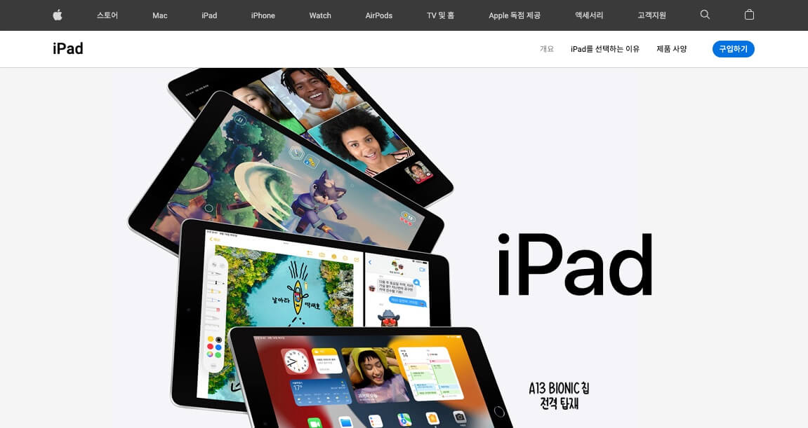
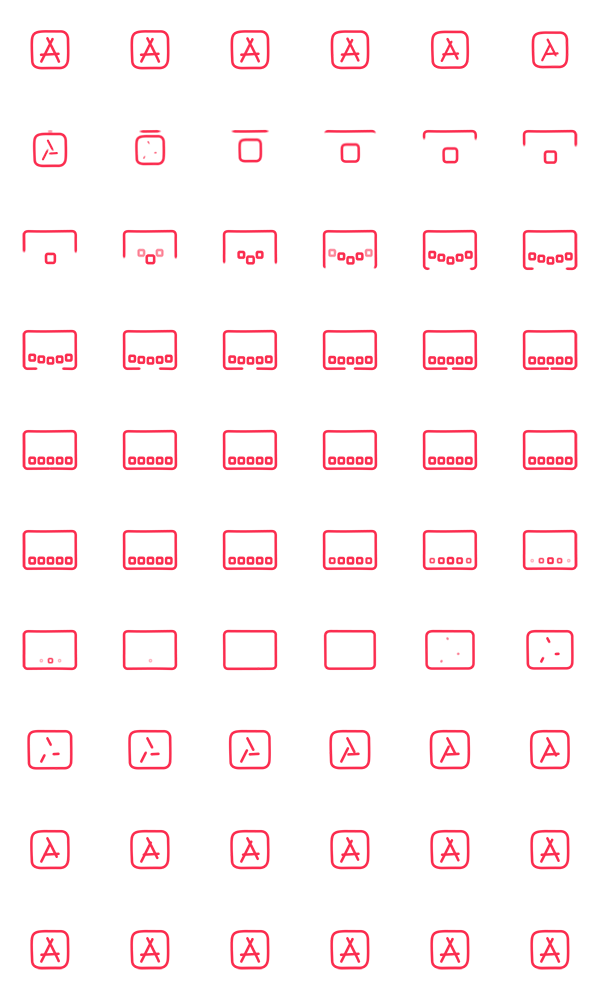

[](https://app.netlify.com/sites/transcendent-naiad-733465/deploys)

# 🍏 iPad

아이패드 제품 페이지를 만드는 예제입니다.

[DEMO](https://transcendent-naiad-733465.netlify.app/)



### Assets

강의 예제에서 사용하는 이미지와 영상 등 에셋을 다운로드합니다.

[에셋 다운로드](./assets.zip)

### Reset.css

각 브라우저의 기본 스타일을 초기화합니다.

```html
<link rel="stylesheet" href="https://cdn.jsdelivr.net/npm/reset-css@5.0.1/reset.min.css" />
```

### Google Fonts

Apple SF Pro 폰트는 공유 및 배포할 수 없기 때문에,  
가장 유사한 웹 폰트로 대체합니다.

영문: [Roboto](https://fonts.google.com/specimen/Roboto)
한글: [Noto Sans KR](https://fonts.google.com/noto/specimen/Noto+Sans+KR)

```html
<link rel="preconnect" href="https://fonts.googleapis.com">
<link rel="preconnect" href="https://fonts.gstatic.com" crossorigin>
<link href="https://fonts.googleapis.com/css2?family=Noto+Sans+KR:wght@400;700&family=Roboto:wght@400;500;700&display=swap" rel="stylesheet">
```

### 오픈 그래프 및 트위터 카드 정보

웹페이지가 소셜 미디어로 공유될 때 우선적으로 활용되는 정보를 지정합니다.

```html
<!--Open Graph-->
<meta property="og:type" content="website" />
<meta property="og:site_name" content="Apple (KR)" />
<meta property="og:title" content="iPad 10.2" />
<meta property="og:description" content="강력한 A13 Bionic 칩을 탑재한 iPad. 센터 스테이지 기술이 적용된 12MP 울트라 와이드 전면 카메라, True Tone 디스플레이 기술 및 64GB 저장 용량까지 갖췄습니다." />
<meta property="og:image" content="./images/ipad-seo.png" />
<meta property="og:url" content="https://www.apple.com/kr/ipad-10.2/" />

<!--Twitter Card-->
<meta property="twitter:card" content="summary" />
<meta property="twitter:site" content="Apple (KR)" />
<meta property="twitter:title" content="iPad 10.2" />
<meta property="twitter:description" content="강력한 A13 Bionic 칩을 탑재한 iPad. 센터 스테이지 기술이 적용된 12MP 울트라 와이드 전면 카메라, True Tone 디스플레이 기술 및 64GB 저장 용량까지 갖췄습니다." />
<meta property="twitter:image" content="./images/ipad-seo.png" />
<meta property="twitter:url" content="https://www.apple.com/kr/ipad-10.2/" />
```

### Hero Contents 가격 요소

원화 단위 입력이 어려운 경우 복사하세요!

```html
<p class="pricing">
  ₩449,000부터
</p>
```

### CSS 변수

`--`로 시작하는 변수를 선언해 값을 할당할 수 있습니다.  
변수가 선언된 선택자 요소를 포함해 하위 요소에서 `var()` 함수를 통해 사용할 수 있습니다.

```css
html {
  --color-white: #FFF;
  --color-black: #000;
  --color-font: #1D1D1D;
  --color-font-darkgray: #6E6E6E;
  --color-font-middlegray: #b7b7b7;
  --color-font-lightgray: #F5F5F5;
  --color-link: #0071E3;
  --color-link-focus: #81B9F1;
  --color-border: #D2D2D2;
  --color-header: #3A3A3A;
  --color-section: #F5F5F5;
  --color-shadow: rgba(0, 0, 0, .4);
}
.example {
  background-color: var(--color-font);
}
```

### Icons

```css
.info .icon.icon--chip         { background-image: url("../images/sprite_chip.png"); }
.info .icon.icon--faster       { background-image: url("../images/sprite_faster.png"); }
.info .icon.icon--neural       { background-image: url("../images/sprite_neural.png"); }
.info .icon.icon--apps         { background-image: url("../images/sprite_apps.png"); }
.info .icon.icon--battery      { background-image: url("../images/sprite_battery.png"); }
.info .icon.icon--display      { background-image: url("../images/sprite_display.png"); }
.info .icon.icon--true-tone    { background-image: url("../images/sprite_true_tone.png"); }
.info .icon.icon--center-stage { background-image: url("../images/sprite_center_stage.png"); }
.info .icon.icon--front-camera { background-image: url("../images/sprite_front_camera.png"); }
.info .icon.icon--back-camera  { background-image: url("../images/sprite_back_camera.png"); }
.info .icon.icon--scan         { background-image: url("../images/sprite_scan.png"); }
.info .icon.icon--download     { background-image: url("../images/sprite_download.png"); }
.info .icon.icon--wifi         { background-image: url("../images/sprite_wifi.png"); }
.info .icon.icon--lte          { background-image: url("../images/sprite_lte.png"); }
.info .icon.icon--pencil       { background-image: url("../images/sprite_pencil.png"); }
.info .icon.icon--keyboard     { background-image: url("../images/sprite_keyboard.png"); }
.info .icon.icon--notes        { background-image: url("../images/sprite_notes.png"); }
.info .icon.icon--covers       { background-image: url("../images/sprite_covers.png"); }
```

### Sprite Icon Animation

여러 이미지를 한 이미지로 합쳐 관리하는 방식을 **이미지 스프라이트 기법** 이라고 합니다.



```css
@keyframes sprite-icon {
  /* 1~10 */
  0.00% { background-position: 0 0; }
  1.67% { background-position: -100px 0; }
  3.33% { background-position: -200px 0; }
  5.00% { background-position: -300px 0; }
  6.67% { background-position: -400px 0; }
  8.33% { background-position: -500px 0; }
  10.00% { background-position: 0 -100px; }
  11.67% { background-position: -100px -100px; }
  13.33% { background-position: -200px -100px; }
  15.00% { background-position: -300px -100px; }

  /* 11~20 */
  16.67% { background-position: -400px -100px; }
  18.33% { background-position: -500px -100px; }
  20.00% { background-position: 0 -200px; }
  21.67% { background-position: -100px -200px; }
  23.33% { background-position: -200px -200px; }
  25.00% { background-position: -300px -200px; }
  26.67% { background-position: -400px -200px; }
  28.33% { background-position: -500px -200px; }
  30.00% { background-position: 0 -300px; }
  31.67% { background-position: -100px -300px; }

  /* 21~30 */
  33.33% { background-position: -200px -300px; }
  35.00% { background-position: -300px -300px; }
  36.67% { background-position: -400px -300px; }
  38.33% { background-position: -500px -300px; }
  40.00% { background-position: 0 -400px; }
  41.67% { background-position: -100px -400px; }
  43.33% { background-position: -200px -400px; }
  45.00% { background-position: -300px -400px; }
  46.67% { background-position: -400px -400px; }
  48.33% { background-position: -500px -400px; }

  /* 31~40 */
  50.00% { background-position: 0 -500px; }
  51.67% { background-position: -100px -500px; }
  53.33% { background-position: -200px -500px; }
  55.00% { background-position: -300px -500px; }
  56.67% { background-position: -400px -500px; }
  58.33% { background-position: -500px -500px; }
  60.00% { background-position: 0 -600px; }
  61.67% { background-position: -100px -600px; }
  63.33% { background-position: -200px -600px; }
  65.00% { background-position: -300px -600px; }

  /* 41~50 */
  66.67% { background-position: -400px -600px; }
  68.33% { background-position: -500px -600px; }
  70.00% { background-position: 0 -700px; }
  71.67% { background-position: -100px -700px; }
  73.33% { background-position: -200px -700px; }
  75.00% { background-position: -300px -700px; }
  76.67% { background-position: -400px -700px; }
  78.33% { background-position: -500px -700px; }
  80.00% { background-position: 0 -800px; }
  81.67% { background-position: -100px -800px; }

  /* 51~60 */
  83.33% { background-position: -200px -800px; }
  85.00% { background-position: -300px -800px; }
  86.67% { background-position: -400px -800px; }
  88.33% { background-position: -500px -800px; }
  90.00% { background-position: 0 -900px; }
  91.67% { background-position: -100px -900px; }
  93.33% { background-position: -200px -900px; }
  95.00% { background-position: -300px -900px; }
  96.67% { background-position: -400px -900px; }
  98.33% { background-position: -500px -900px; }
}
```

JS로 각 프레임 위치 및 속성값 쉽게 만들기

```js
let x = 0
let y = 0
let frames = ''
for (let i = 0; i < 60; i += 1) {
  // frames += `${(100 / 60 * i).toFixed(2)}% { background-position: ${x}px ${y}px; }<br />` // HTML으로 출력!
  frames += `${(100 / 60 * i).toFixed(2)}% { background-position: ${x}${x === 0 ? '' : 'px'} ${y}${y === 0 ? '' : 'px'}; }\n`
  if (x <= -500) {
    x = 0
    y -= 100
    continue // 현재 반복을 종료하고 다음 반복으로 넘어가기!
  }
  x -= 100
}
// document.body.innerHTML = frames // HTML으로 출력!
console.log(frames)
```

### IntersectionObserver

[IntersectionObserver(요소의 가시성 관찰)](https://heropy.blog/2019/10/27/intersection-observer/)  
브라우저 뷰포트(Viewport)와 설정한 요소(Element)의 교차점을 관찰하여, 요소가 보이는지 보이지 않는지 구별하는 기능.

```js
// 요소의 가시성 관찰 로직!
const io = new IntersectionObserver(entries => {
  // entries는 `io.observe(el)`로 등록된 모든 관찰 대상 배열.
  entries.forEach(entry => {
     // 사라질 때.
    if (!entry.isIntersecting) {
      return
    }
    entry.target.classList.add('show')
  })
})
// 관찰할 요소들 검색
const infoEls = document.querySelectorAll('.info')
// 관찰 시작!
infoEls.forEach(el => io.observe(el))
```

### iPad 종류

```js
export default [
  {
    thumbnail: './images/compare_ipad_pro.png',
    colors: ['#68696D', '#E2E3E5'],
    name: 'iPad Pro',
    tagline: '궁극의 iPad란<br />이런 것.',
    price: 999000,
    url: '/ipad-pro/'
  },
  {
    thumbnail: './images/compare_ipad_air.png',
    colors: ['#68696D', '#E2E3E5', '#E8D2CE', '#B9B8D1', '#88AEBF'],
    name: 'iPad Air',
    tagline: '강력하다. 다채롭다.<br />경이롭다.',
    price: 779000,
    url: '/ipad-air/'
  },
  {
    thumbnail: './images/compare_ipad_10_2.png',
    colors: ['#68696D', '#E2E3E5'],
    name: 'iPad',
    tagline: '만족스러운 성능.<br />기분 좋은 가격.',
    price: 449000,
    url: '/ipad-10.2/'
  },
  {
    thumbnail: './images/compare_ipad_mini.png',
    colors: ['#68696D', '#E2E3E5', '#E8D2CE', '#B9B8D1'],
    name: 'iPad Pro',
    tagline: '메가급 성능.<br />크기만 미니.',
    price: 649000,
    url: '/ipad-mini/'
  }
]
```

### 푸터 메뉴

```js
export default [
  {
    title: '쇼핑 및 알아보기',
    maps: [
      { name: '스토어', url: '/shop/goto/store' },
      { name: 'Mac', url: '/mac' },
      { name: 'iPad', url: '/ipad' },
      { name: 'iPhone', url: '/iphone' },
      { name: 'Watch', url: '/watch' },
      { name: 'AirPods', url: '/airpods' },
      { name: 'TV 및 홈', url: '/tv-home' },
      { name: 'AirTag', url: '/airtag' },
      { name: '액세서리', url: '/shop/goto/buy_accessories' }
    ]
  },
  {
    title: '서비스',
    maps: [
      { name: 'Apple Music', url: '/apple-music' },
      { name: 'Apple TV+', url: '/apple-tv-plus' },
      { name: 'Apple Arcade', url: '/apple-arcade' },
      { name: 'iCloud', url: '/icloud' },
      { name: 'Apple Books', url: '/apple-books' },
      { name: 'Apple Podcast', url: '/apple-podcasts' },
      { name: 'App Store', url: '/app-store' }
    ]
  },
  {
    title: '계정',
    maps: [
      { name: 'Apple ID 관리', url: 'https://appleid.apple.com' },
      { name: 'Apple Store 계정', url: '/shop/goto/account' },
      { name: 'iCloud.com', url: 'https://www.icloud.com' }
    ]
  },
  {
    title: 'Apple Store',
    maps: [
      { name: '매장 찾기', url: '/retail' },
      { name: 'Genius Bar', url: '/retail/geniusbar' },
      { name: 'Today at Apple', url: '/today' },
      { name: 'Apple 캠프', url: '/today/camp' },
      { name: 'Apple Store 앱', url: 'https://apps.apple.com/app/apple-store/id375380948' },
      { name: '리퍼 및 특가 제품', url: '/shop/goto/special_deals' },
      { name: '금융 혜택', url: '/shop/goto/financing' },
      { name: 'Apple Trade In', url: '/trade-in' },
      { name: '주문 상태', url: '/shop/goto/order/list' },
      { name: '쇼핑 도움말', url: '/shop/goto/help' }
    ]
  },
  {
    title: '비즈니스',
    maps: [
      { name: 'Apple과 비즈니스', url: '/business' },
      { name: '비즈니스를 위한 제품 쇼핑하기', url: '/retail/business' }
    ]
  },
  {
    title: '교육',
    maps: [
      { name: 'Apple과 교육', url: '/education' },
      { name: '초중고용 제품 쇼핑하기', url: '/education/k12/how-to-buy' },
      { name: '대학 생활을 위한 제품 쇼핑하기', url: '/shop/goto/educationrouting' }
    ]
  },
  {
    title: 'Apple의 가치관',
    maps: [
      { name: '손쉬운 사용', url: '/accessibility' },
      { name: '환경', url: '/environment' },
      { name: '개인정보 보호', url: '/privacy' },
      { name: '협력업체에 대한 책임', url: '/supplier-responsibility' }
    ]
  },
  {
    title: 'Apple 정보',
    maps: [
      { name: 'Newsroom', url: '/newsroom' },
      { name: 'Apple 리더십', url: '/leadership' },
      { name: '채용 안내', url: '/careers' },
      { name: '윤리 및 규정 준수', url: '/compliance' },
      { name: '이벤트', url: '/apple-events' },
      { name: '일자리 창출', url: '/job-creation' },
      { name: 'Apple 연락처', url: '/contact' }
    ]
  }
]
```

### 문장 정리

강의에서 직접 작성하는 문장은, 아래에서 순서대로 복사/붙여넣기 할 수 있습니다.

```plaintext
#### Hero

iPad와 Smart Keyboard 및 Apple Pencil
센터 스테이지 기술이 적용된 새로운 울트라 와이드 전면 카메라
A13 BIONIC 칩 전격 탑재
저장 용량은 64GB부터
매사를 더욱 쉽게.
₩449,000부터
강력한 성능에 간편함과 다재다능까지 갖춘 새로워진 iPad. 당신이 어떤 일을 즐겨하든 함께할 수 있도록 디자인되었습니다. 작업, 취미, 공부, 소통 등. 이 모든 것을 부담 없이 누릴 수 있죠.
이벤트 시청하기
iPad를 선택하는 이유

#### Power

거침없는 일 처리 성능.
Keynote 마크업과 메시지가 함께 표시된 Split View
동시에 여러 앱 사용 가능
iPad에 Wonderbox 앱이 열려 있는 모습
신나게 즐기는 새로운 APPLE ARCADE 게임
A13 Bionic 칩이 메시지 전송, 인터넷 서핑, 여러 앱 동시에 사용하기 등 모든 작업에 더욱 탁월한 반응성을 더해줍니다.
최대 20% 빨라진 GPU로 뛰어난 그래픽 성능을 선사합니다. 몰입감 넘치는 게임 등 더 많은 것을 즐기는 데 안성맞춤이죠.
더욱 강력해진 Neural Engine이 iPadOS 15의 라이브 텍스트와 같은 머신 러닝 기반 기능을 구현해줍니다.
A13 Bionic 칩은 Adobe Fresco, Procreate와 같은 첨단 앱도 거뜬히 구동합니다.
온종일 가는 배터리를 갖춘 iPad. 당신이 열공 모드일 때도, 게임 삼매경에 빠져 있을 때도 늘 함께할 준비가 되어 있습니다.
Procreate에서 Apple Pencil로 그림이 그려져 있는 모습
스케치하고, 그리고, 색칠하고

#### Display

빛나는 아이디어에 걸맞은 디스플레이.
iPad의 Goodnotes 5 앱에서 편집 중인 손글씨 필기
노트 필기는 GOODNOTES 5로
SharePlay 기능으로 영상을 함께 즐기는 모습
함께 보고 함께 즐기고
놀랍도록 섬세한 디테일과 생생한 색상을 자랑하는 25.9cm Retina 디스플레이를 갖춘 iPad. 영화를 감상할 때도, 프로젝트를 진행할 때도 또는 멋진 그림을 그릴 때도 더할 나위 없죠.
True Tone이 주변의 조명에 맞춰 색온도를 조절해줍니다. 덕분에 어떤 조명에서도 눈이 편안한 화면을 경험할 수 있죠.

#### Camera

촬영에서 편집 공유까지 한 기기에서.
센터 스테이지 기술이 영상 통화 시 당신이 언제나 화면 중앙에 있도록 자동으로 카메라를 조정해 줍니다. 덕분에 서로에게 더 집중할 수 있게 되죠. SNS에 올릴 재미난 동영상을 만들 때도 요긴하답니다.
iPad상의 영상 통화 중 센터 스테이지 기능이 사용되는 예시
센터 스테이지 덕분에 영상 통화도 더 자연스럽게
12MP 울트라 와이드 전면 카메라는 센터 스테이지 기술뿐만 아니라 엄청나게 향상된 이미지 화질을 자랑합니다. 덕분에 더욱 훌륭한 셀카와 단체 사진도 찍을 수 있죠.
iPad 후면에 탑재된 8MP 와이드 카메라는 선명하고 또렷한 사진과 동영상을 담을 수 있습니다.
다재다능한 후면 카메라로 문서를 스캔하고 몰입감 넘치는 AR 앱을 즐길 수도 있습니다.
사진 앱에서 편집되고 있는 이미지
사진도 동영상도 찍고 편집하고

#### Wireless

선이 없다는 건 한계가 없다는 것.
19명이 참여 중인 FaceTime 영상 통화
FACETIME으로 소통하고
어디에서든 파일을 다운로드하고, 영화를 스트리밍하고, 동료와 협업하거나 콘텐츠를 업로드할 수 있습니다.
고속 Wi-Fi 덕분에 집, 직장, 학교 등 iPad와 함께하는 어디에서든 인터넷에 연결할 수 있습니다.
Gigabit급 LTE 덕분에 Wi-Fi에 연결할 수 없는 경우에도 온라인 접속이 가능합니다.
셀룰러에 대해 더 알아보기
파일, iCloud Drive 선택 화면
모든 파일 확인을 이동 중에도

#### Accessories

손으로 쓰거나 키보드로 치거나.
Smart Keyboard와 Apple Pencil이 갖춰진 iPad에서 Split View로 Mail 앱의 이메일과 메모 앱의 손글씨 필기
이메일도 타이핑 하고 손글씨 메모도 적고
SMART KEYBOARD 및 APPLE PENCIL 지원
Apple Pencil은 실제 펜으로 종이에 쓰듯 자연스러운 느낌을 선사합니다. 동시에 당신의 손글씨를 키보드로 입력한 텍스트만큼이나 강력하게 만들어주는 탁월한 역량을 자랑하죠.4
얇고 가벼운 Smart Keyboard를 부착해 편안하게 타이핑하세요. 리포트 작성, 업무 기획 등에 딱이죠.
Apple Pencil을 활용해 기억에 남는 메모를 끄적이고, 멋진 예술 작품을 만들고, 스크린샷에 마킹하는 등 실로 다양한 일을 할 수 있답니다.
Apple Pencil에 대해 더 알아보기
Smart Keyboard는 접으면 어딜 가든 iPad를 보호해주는 슬림하고 가벼운 커버가 되어줍니다.4
Smart Keyboard에 대해 더 알아보기

#### iPadOS

iPadOS. 작업의 성공 방정식.
널찍한 Multi-Touch 디스플레이를 위해 디자인된 iPadOS는 강력하면서도 누구든 손쉽게 사용할 수 있습니다.
iPadOS 15은 사용하기 쉬운 멀티태스킹 기능, 정보를 검색하고 정리하는 새로운 방식, 향상된 메모 기능 등을 통해 iPad의 성능을 한층 더 끌어올립니다.
iPadOS의 새로운 기능 살펴보기
Split View로 이미지를 편집하면서 Mail 앱을 사용 중인 모습
두 개의 앱, 서로 양옆에 놓고 쓰기
홈 화면에 표시된 위젯
홈 화면에 바로 뜨는 위젯
Safari의 빠른 메모
어디서나 남기는 빠른 메모

#### Apps

열정을 살려줄 다양한 앱.
iPad에는 이미 ‘사진’, ‘지도’, ‘메시지’, Mail, Safari 등 강력한 Apple 제작 앱들이 가득 담겨있습니다. 게다가 100만 개 이상의 iPad 전용 앱이 준비된 App Store에서는 어떤 작업이든 걸맞은 앱을 찾을 수 있죠. 비트를 찍거나, 운동을 하거나, 뉴스를 읽을 수도 있습니다. 심심할 땐 친구들과 신나는 게임 한 판을 즐길 수도 있죠.
App Store에서 iPad용 앱 찾아보기
iPad에 MasterClass 앱이 열려 있는 모습
Masterclass
iPad에 Adobe Fresco 앱이 열려 있는 모습
Adobe Fresco
iPad에 Fantasian 앱이 열려 있는 모습
Fantasian
iPad에 도서 앱이 열려 있는 모습
도서 앱
iPad에 Goodnotes 5 앱이 열려 있는 모습
GoodNotes 5

#### Privacy

개인정보 보호 기능 내장.
다른 모든 Apple 제품과 마찬가지로 iPad 역시 당신의 개인 정보 보호 및 보안을 염두에 두고 설계되었습니다. 결코 쉽지만은 않은 작업이죠. 하지만 그런 것만이 진정한 혁신이라 우리는 믿습니다.
개인 정보 보호를 위한우리의 노력에 대해 더 알아보기
Safari에 표시
Apple로 로그인
지문으로 로그인하기

#### Accessibility

모두를 위해 만들다.
누구나 사용할 수 있는 기술이야말로 가장 강력한 기술입니다. iPad에 시각, 청각, 운동 및 인지능력 등을 보완해주는 손쉬운 사용 기능을 탑재한 이유도 바로 그 때문이죠. 그룹 FaceTime 통화 중 수어를 사용하는 사람이 있는 경우, 그 사람이 이야기 중인 것을 알 수 있도록 해당 타일을 더 크게 표시해주는 것이 좋은 예입니다.
모든 손쉬운 사용 기능 살펴보기
FaceTime 앱으로 4명이 수어로 영상 통화

#### AR

AR Icon
AR로 새로워진 iPad 미리 보기.
iPhone 또는 iPad에서 이 페이지를 Safari로 열어보세요.
AR Image

#### Environment

Environment Icon
환경
Apple은 제품의 라이프 사이클 전반에 걸쳐 우리의 환경 발자국에 대한 책임을 다합니다.
모든 Apple 제품과 포장재에 100% 재활용 및 재생 가능 소재만이 사용되는 그날을 위해 헌신적인 노력을 기울이고 있습니다.
iPad는 환경에 미치는 영향을 줄이도록 다양한 특징을 적용하여 디자인되었습니다.
Apple과 환경에 대해 더 알아보기

#### Accessory Shop

iPad의 능력을 키워주는 액세서리.
케이스, 커버, Apple Pencil, AirPods 등 다양한 액세서리를 만나보세요.
iPad 액세서리 쇼핑하기
다양한 액세서리 이미지

#### Trade

사용하던 iPad를 보상 판매하면 새 모델
구매 시 쓸 수 있는 크레딧이.*
Apple Trade In을 통해 보상 판매 대상 iPad를 새 iPad 구매 시 쓸 수 있는 크레딧으로 교환할 수 있습니다.
기기의 가치를 최대한 활용하는 것, 당신은 물론 지구에게도 좋은 일이죠.
보상 판매 가격 알아보기

#### Compare

당신에게 맞는 iPad는?
iPad Pro
궁극의 iPad란이런 것.
₩999,000부터

iPad Air
강력하다. 다채롭다.경이롭다.
₩779,000부터

iPad
만족스러운 성능.기분 좋은 가격.
₩449,000부터

iPad Pro
메가급 성능.크기만 미니.
₩649,000부터

모든 iPad 모델 비교하기
iPad 쇼핑하기

#### Footer

무료 익일 배송 Icon
업무일 기준 무료 익일 배송
오후 3시 이전에 주문된 재고 보유 제품에 한합니다.

금융 혜택 Icon
금융 혜택
무이자 할부를 통해 Apple 제품을 부담 없이 구매하실 수 있습니다.

각인 Icon
진정 자신만의 것으로
자신의 이름이나 개성 있는 문구를 iPad에 무료로 각인할 수 있습니다.

* 보상 판매 프로그램은 Apple의 파트너이자 독립적으로 운영되는 제3의 업체에 의해 제공됩니다. Apple 및 Apple의 계열사는 고객과 파트너 간 계약의 당사자가 아닙니다. 보상 판매 금액은 보상 판매되는 iPad의 상태 및 모델에 따라 달라집니다. 19세 이상이어야 합니다. 일부 매장에서는 본 프로그램을 이용할 수 없으며, 일부 기기는 보상 판매 대상이 아닙니다. Apple은 어떤 보상 판매도 거래를 거부하거나, 제한할 귄리를 보유합니다. 새 Apple 기기 구매 시, 현재 소유한 기기의 가치만큼 할인을 받을 수도 있습니다. 추가 약관은 apple.com/kr/trade-in을 참고하십시오.
배터리 사용 시간은 사용 패턴 및 설정에 따라 다를 수 있습니다. 자세한 내용은 apple.com/kr/batteries를 참고하십시오.
직사각형 기준으로 측정했을 때, iPad 화면은 대각선 길이 기준 25.91cm입니다.
데이터 요금제에 가입해야 합니다. Gigabit급 LTE는 일부 국가에서 일부 이동통신사를 통해 사용 가능합니다. 속도는 이론적 처리량에 근거한 수치이며 장소 및 이동통신사에 따라 다를 수 있습니다. LTE 지원에 대한 자세한 내용은 이동통신사에 문의하거나 apple.com/kr/ipad/cellular를 참고하십시오.
Apple Pencil(1세대) 및 Smart Keyboard는 별도로 판매됩니다.
앱은 App Store에서 다운로드할 수 있습니다. 각 앱의 출시 여부는 변경될 수 있습니다.
AirPods(2세대) 무선 충전 케이스 모델 및 액세서리는 별도로 판매됩니다.

다양한 쇼핑 방법: Apple Store를 방문하거나, 리셀러를 찾아보거나, 080-330-8877번으로 전화하세요.
Copyright © 2023 Apple Inc. 모든 권리 보유.
개인정보 처리방침
웹 사이트 이용 약관
판매 및 환불
법적 고지
사이트 맵
대한민국
```

